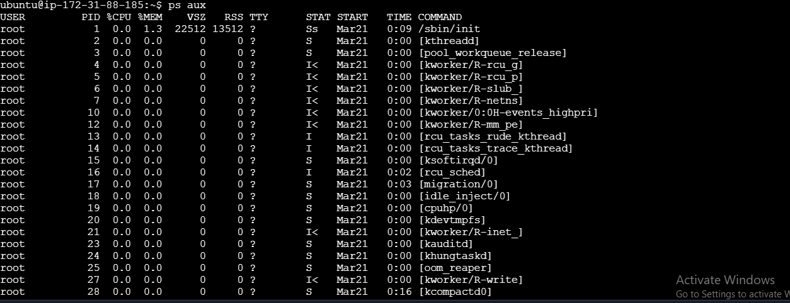
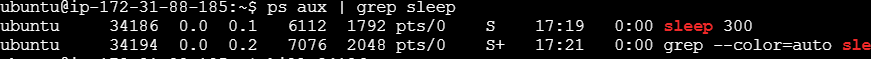
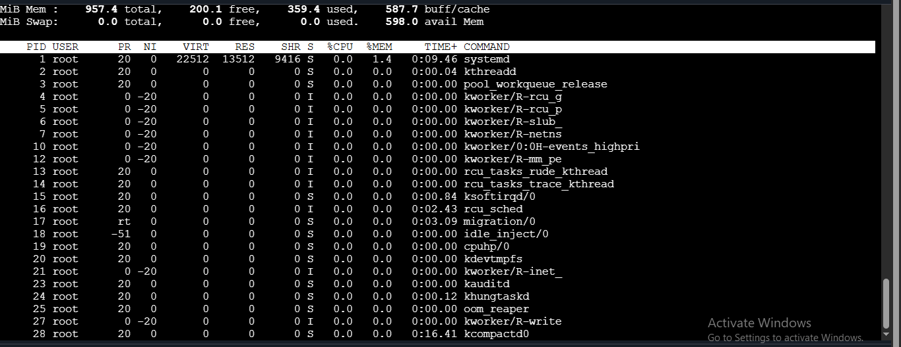
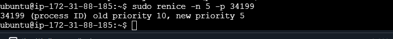

# process-management
Start a long-running process in the background
sleep 300 &

List all running processes.
ps aux

Find the process ID (PID) of the sleep process and kill it.
ps aux | grep sleep
kill <PID>

Monitor System Resources
Use top to monitor system resources.
top

# Change Process Priority
Start a new sleep process and change its priority using nice and renice.

nice -n 10 sleep 300 &

renice -n 5 -p 34199
this will not work because I did not add sudo command

sudo renice -n 5 -p 34199
